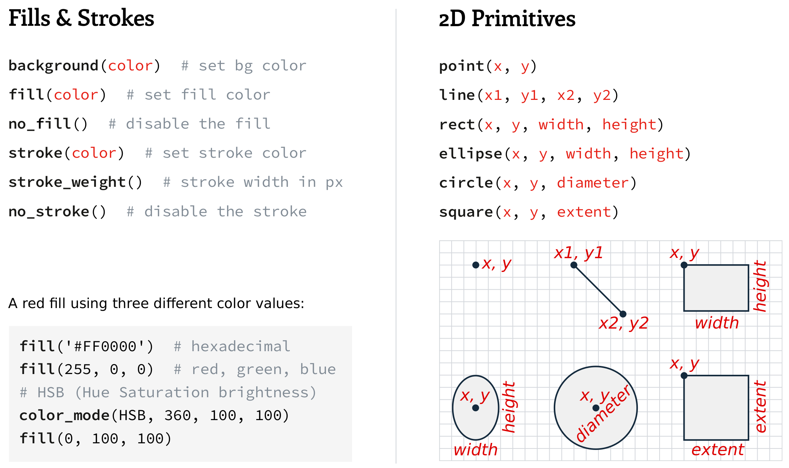
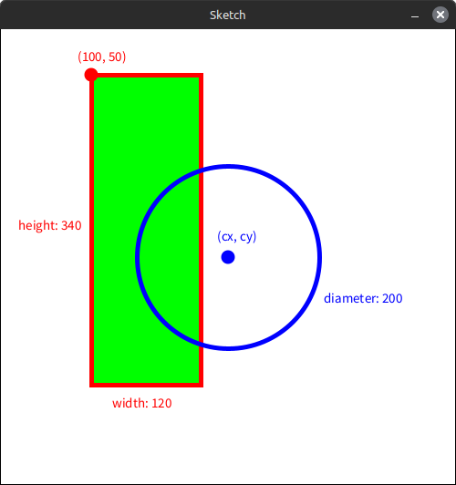
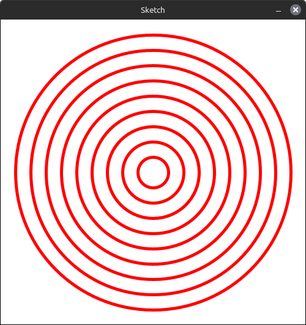
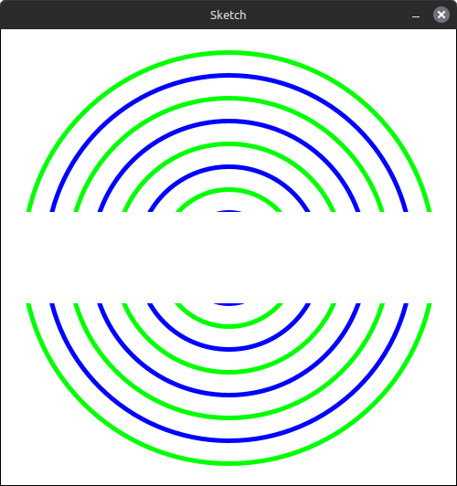
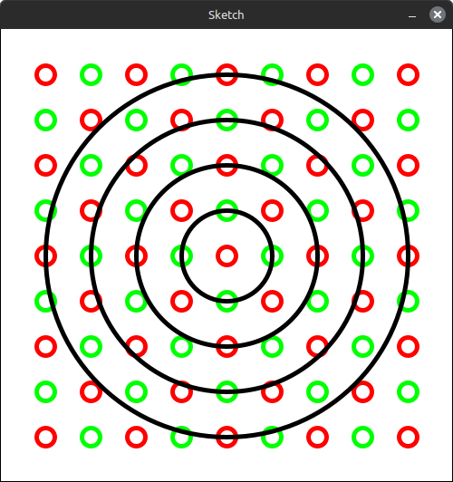
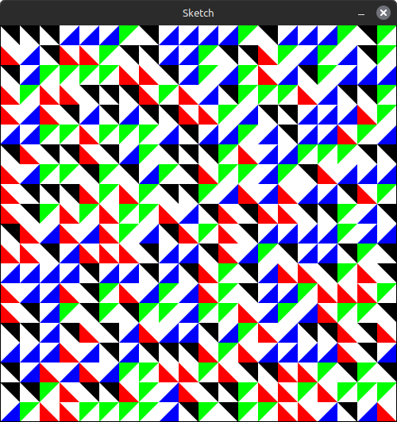

<table>
  <tr>
    <th colspan="2"><h1>Assessment 2 Brief</h1></th>
  </tr>
  <tr>
    <th>Subject Code and Title</th>
    <td>ITP122 Introduction to Programming</td>
  </tr>
  <tr>
    <th>Assessment</th>
    <td>Intermediate Programming Tasks</td>
  </tr>
  <tr>
    <th>Individual/Group</th>
    <td style="background-color:red">? Group ?</td>
  </tr>
  <tr>
    <th>Length</th>
    <td>source code and comments</td>
  </tr>
  <tr>
    <th>Learning Outcomes</th>
    <td>
      The Subject Learning Outcomes demonstrated by successful completion of the task below include:
      <ol type="a">
        <li>Select appropriate programming development tools and methodologies to meet the software requirements.</li>
        <li>Apply coding, debugging and testing skills in software development using a suitable IDE (integrated development
environment) platform.</li>
        <li>Validate and verify computer programs to meet the software requirements.</li>
      </ol>
    </td>
  </tr>
  <tr>
    <th>Submission</th>
    <td>Due by 11:55pm AEST/AEDT, Sunday, end of Module 08</td>
  </tr>
  <tr>
    <th>Weighting</th>
    <td>45%</td>
  </tr>
  <tr>
    <th>Total Marks</th>
    <td>100 marks</td>
  </tr>
</table>

## Assessment Task

You must complete **four programming tasks** that demonstrate your understanding of decision logic (if-else statements) and loops (for and while) based on the concepts covered in Modules 2 to 8. Each program should include clear and concise documentation in the form of comments explaining the logic and functionality of the code.

## Context

This assessment focuses on writing Python scripts that generate graphic output using the **Thonny Python IDE** with the **Thonny-py5mode plugin**. To set up your development environment for the assessment, follow the installation guide here:  

https://pypi.org/project/thonny-py5mode

In Assessment 1, you applied and explained the use of variables, expressions, basic and intermediate conditionals, and other fundamental programming concepts. In this assessment, you'll expand upon this knowledge by implementing intermediate-level decision logic and loops, marking an important step toward developing problem-solving skills and confidence in devising software solutions.

### Key Objectives

- Implement **if-else** statements for decision-making
- Use **for** and **while** loops to manage repetition
- Generate **graphic output** using the **Thonny-py5mode plugin**
- Provide well-structured **comments** to explain your code

## Instructions

Each task begins with some code to get you started. The goal is to complete the script so that your output matches each graphic provided. Here's a summary of the different functions you'll need:



You'll add Python `if`, `else`, `for`, and other statements the those above to successfully complete each task.

## A Quick Demonstration

Using Thonny-py5mode, you can draw different lines, shapes, and colours using different functions. Here's a basic example:

```python
# setup
size(500, 500)           # canvas size
background('#FFFFFF')    # background colour
cx = width / 2           # canvas horizontal centre
cy = height / 2          # canvas vertical centre

stroke_weight(5)         # set outline to 5-pixels-wide

# draw rectangle
stroke('#FF0000')        # set outline to red
fill('#00FF00')          # set fill to green
rect(100, 50, 120, 340)  # draw rectangle

# draw circle
no_fill()                # set fill to none
stroke('#0000FF')        # set outline to blue
circle(cx, cy, 200)      # draw circle
```
Note that commands like `stroke()` and `fill()` remain in effect until you override their behaviour, like using a paint brush -- when you dip it in a red it paints in red until you dip it in blue.

You'll notice that colours are specified using hexadecimal values. You can access a mixer using **py5 > Color selector** in the Thonny interface. Here's the result:



## Task 1

### Task 1.1

Here's the result you're working toward:



Starter code:
```python
# setup
size(500, 500)           # canvas size
background('#FFFFFF')    # background colour
cx = width / 2           # canvas horizontal centre
cy = height / 2          # canvas vertical centre

i = 1

while i < 10:
    no_fill()
    stroke_weight(5)
    # ... INSERT MISSING CODE HERE ...
    i += 1
```
### Task 1.2

Here's the result you're working toward:



Starter code:
```python
# setup
size(500, 500)           # canvas size
background('#FFFFFF')    # background colour
cx = width / 2           # canvas horizontal centre
cy = height / 2          # canvas vertical centre
no_fill()                # set fill to none
stroke_weight(5)         # set outline to 5-pixels-wide

# ... INSERT MISSING CODE HERE ...
```

### Task 1.3

Here's the result you're working toward:



Starter code:
```python
size(500, 500)
background('#FFFFFF')

# ... INSERT MISSING CODE HERE ...
```

## Task 2

Here's the result you're working toward:


Use (`for`?) loops to draw the rows of blue, red, and green dots. You must use `break` and/or `continue` statements to control the interruptions of the red and green dots. **TIP:** Consider nesting if statements within your loops and how you might utilise the `line_1_x` and `line_2_x` variables.

Starter code:

```python
size(500, 500)
background('#FFFFFF')
rotate(0.1)  # rotates the entire drawing space by ~6 degrees

line_1_x = 300
line_2_x = 400

# draw two grey lines
stroke_weight(5)
stroke('#999999') # grey
line(300, 0, line_1_x, height)
line(400, 0, line_2_x, height)
no_stroke()

# loop for blue dots
# ... INSERT MISSING CODE HERE ...

# loop for red dots
# ... INSERT MISSING CODE HERE ...

# loop for green dots
# ... INSERT MISSING CODE HERE ...
```

## Task 3

Here's the result you're working toward:


Draw each patterns in a single canvas, using a separate loop for each. You'll need to use the `line()` function. You may find the [`translate()`](https://py.processing.org/reference/translate) function useful (although this isn't required). 

Starter code:
```python
size(800, 500)
background('#FFFFFF')
stroke('#000000')
stroke_weight(5)

# ... INSERT MISSING CODE HERE ...
```

## Task 4

This task involves [Truchet tiles](https://en.wikipedia.org/wiki/Truchet_tiles) -- four contrasting tiles that are randomly distributed in a grid formation to make interesting patterns. Here's the result you're working toward:



Here are the four tiles, which you can draw using the `triangle()` function:


Each time you run the script, it must produce a different random arrangement. You'll need to use the `random()` function, which returns a random value between 0.0 and 0.1

Starter code:
```python
size(500, 500)
background('#FFFFFF')
no_stroke()
fill('#000000')

tile_size = 25

# single blue tile demonstration
fill('#0000FF')
triangle(
    tile_size, 0,          # point 1 x-y coord
    tile_size, tile_size,  # point 2 x-y coord
    0, tile_size           # point 3 x-y coord
)

for i in range(10):
    print(random())        # ten random values between 0.0 and 1.0 

# ... INSERT MISSING CODE HERE ...
```

## Submission

### Prepare your files

- Ensure you have written your student ID and name as a code comment at the top of each file
- Make a zip folder containing all your files (namely, a Python file for each of the following tasks: 1.1, 1.2, 1.3, 2, 3, and 4)
- Name your zip file to match this format: *ITP122_LastnameFirstname_A2.zip*

### Credit any sources

As many online programming resources provide solutions to programming tasks along with documentation, if any such source code is acquired (reference works, documentation, help and tutorial sites, etc), it must be preceded by a code comment that lists the original site/creator and followed by a comment that declares the end of the acquired code. Acquisitions should be kept to a few lines or less and solve single problems (i.e., changing the range of a randomly generated number, handling unexpected types of input data and so forth).

### Submit your files

Your submission will contain the zip archive of your project; submit this via the **Assessment 2** link in the main navigation menu in the *ITP122 Introduction to Programming* MyLearn portal.

Your Lecturer(s) will provide grades and feedback via MyLearn.

Before you submit your assessment, please ensure you have read and understood Torrens Academic Integrity policies: https://library.torrens.edu.au/academic_integrity. If you are unsure about anything , please reach out to your lecturer.
